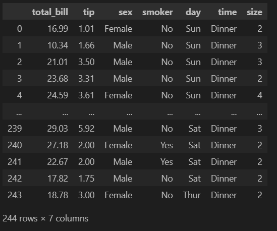

# Data Analysis and Visualization on the Tips Dataset

This script performs exploratory data analysis (EDA) on the tips dataset, including visualizing the distribution of genders and smokers, and analyzing the distribution of total bill and tips using histograms and boxplots. The script also handles missing values and removes duplicates from the dataset.

## Prerequisites

- Python 3.x
- pandas
- numpy
- scipy
- matplotlib
- seaborn

## Installation

1. Clone the repository or download the script.
2. Ensure you have the required libraries installed. You can install them using pip:

   ```sh
   pip install pandas numpy scipy matplotlib seaborn
   ```

## Usage

1. **Load Your Dataset**:
   Ensure your dataset (`tips.csv`) is in the same directory as your script or adjust the file path accordingly.

2. **Run the Script**:
   Execute the script to generate various visualizations and perform data preprocessing.


### Explanation

1. **Load the Dataset**:
   ```python
   data = pd.read_csv('tips.csv')
   df = pd.DataFrame(data)
   ```
   Loads the tips dataset into a pandas DataFrame.
   

2. **Gender Distribution**:
   - Counts the occurrences of each gender.
   - Creates a pie chart with percentage and actual count labels.

3. **Smoker Distribution**:
   - Counts the occurrences of smokers and non-smokers.
   - Creates a pie chart with percentage and actual count labels.

4. **Dataset Information and Summary Statistics**:
   - Displays information about the dataset.
   - Displays summary statistics of the dataset.

5. **Total Bill Analysis**:
   - Creates a histogram to visualize the distribution of total bills.
   - Creates a boxplot to visualize the spread and outliers of total bills.

6. **Tip Analysis**:
   - Creates a histogram to visualize the distribution of tips.
   - Creates a boxplot to visualize the spread and outliers of tips.

7. **Handling Missing Values**:
   - Counts and displays the number of missing values in each column.

8. **Removing Duplicates**:
   - Removes duplicate rows from the dataset.
   - Displays the shape of the dataset before and after removing duplicates.

